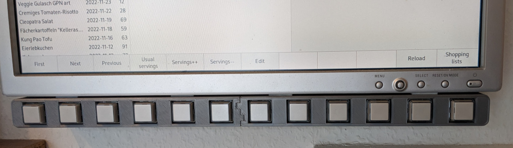
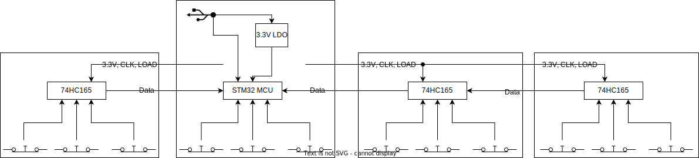
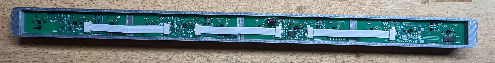
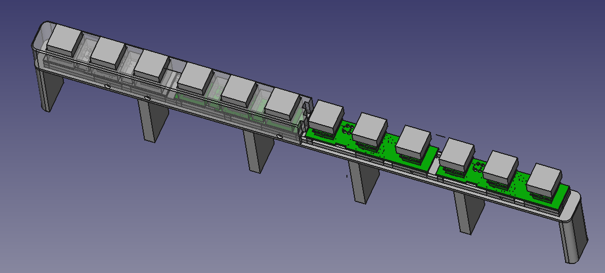
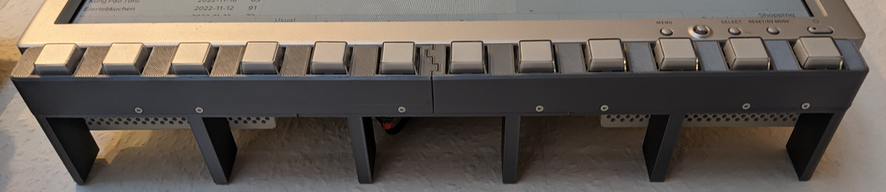

Kitchen information system keypad
=================================

A long while ago we installed a 19" screen and a Raspberry Pi in our 
kitchen for displaying recipes and grocery shopping lists. It's running a 
bespoke recipe and shopping list management application written in … 
C++ and Gtk. All data is held in a PostgreSQL database so it can 
easily be accessed from multiple clients on the network.

One slight annoyance of this setup is that it lacks any sort of local 
input and the only way to control it is by KDE Connect or VNC. Just 
putting a wireless keyboard/touchpad combo somewhere was deemed as too 
unwieldy, so there was only one solution left: Make soft keys that go below the screen. While soft keys may seem clunky in 
the age of touch screens, I've still got a soft spot for 
them. The thing with touch user interfaces is that they're quite hard 
to get right. So especially in devices where the user interface is just 
another item on the BOM such as cars or printers, they tend to turn out 
not so well. Soft keys however are really easy to implement and I 
haven't really been let down by any implementation so far. Apart from 
that soft key user interfaces have great discoverability since all of 
the options are listed on screen and there are no gestures to be 
discovered.

And so, the idea for this project was born.

Hardware
--------

After some consideration, I deemed 12 to be the right number of keys 
for this application. To give the keys a satisfying clicky feel, I picked 
Cherry MX blue switches. Since I don't like my projects looking like a 
rats nest of wires, everything had to go onto a PCB. The 38&nbsp;cm 
wide visible area of the screen thus required 
somehow connecting four identical boards to keep them within the 10×10cm area of 
JLCPCB's cheapest offer.

All boards being identical however doesn't mean that they have to be 
populated with the same components, so I came up with this concept:

The main circuit board is home to an STM32F042 MCU, USB connector, voltage 
regulator and of course three keys. The other circuit boards don't have 
an MCU, instead they have a 
[74HC165](https://assets.nexperia.com/documents/data-sheet/74HC_HCT165.pdf) parallel-in serial-out
shift register so that they can be 
connected to the main board in a daisy-chained configuration. For 
maximum flexibility, zero ohm jumpers select whether the data is 
shifted from left to right or from right to left.

Five signals are required to connect the shift register boards to each 
other or the main board:

 1. Ground
 2. +3.3&nbsp;V
 3. Load for loading the key state into the shift registers
 4. Shift clock
 5. Data
 
While the shift register requires one more pin than directly connecting 
the keys, it enables daisy-chaining boards as required. These signals 
are routed to FFC connectors so that I could use pre-made FFC cables 
for connecting the boards and didn't have to make my own cable 
assemblies.

Since a drawing and photo say more than 1e3 words, here's how it all looks 
connected:

As usual, the board is made with [Horizon 
EDA](https://horizon-eda.org/). [Schematics](kis-keypad/output/schematic.pdf)

Firmware
--------

The firmware for the STM32 is rather trivial as it just needs to be a 
USB HID keyboard that reads the key states from the two chains of 
shift registers. As usual, I used the STM32CubeMX tool to take care of 
the peripheral initialization and USB device stack. Unfortunately the 
built-in HID class contains the descriptors for a pointing device, so 
changing it into a keyboard required changing the usually 
not-to-be-customized parts of the code that get overwritten when 
regenerating it. I copied the relevant code sippets from 
[this](https://controllerstech.com/how-to-use-stm32-as-a-keyboard/) 
article. After scratching my head for a while why it still wasn't 
working as it should, I found out that I also had to change the 
IN endpoint size to match the report length.

To not bother with reconfiguring the SPI peripheral and GPIOs to read 
from either the left or the right chain of shift registers, I 
implemented bit-banged SPI that reads both shift register chains at once.

Once all of the local and remote keys are read, all that's left to to 
is detect if any key has changed its state since the last scan cycle and 
send a HID report with the currently-pressed keys. The twelve keys map 
to <kbd>F1</kbd> … <kbd>F12</kbd>.

Mechanical Construction
-----------------------

Same as with the boards, the large size of this device required 
breaking up the case into multiple parts so that each one fits withing 
the build volume of a 3D printer.

The front shell is divided into two loosely interlocking pieces. The 
rear shell is made up of three pieces to support the split front.

Overall construction is similar to most of my 
[past](https://github.com/carrotIndustries/cyclotron-mini/) PCB-in-plastic 
[projects](https://github.com/carrotIndustries/hubble/) with the board 
being held in place by two shells being joined by M2 screws that thread directly into the plastic.

The rear shell has supporting feet that rest against the wall the 
screen is mounted to. The device itself is affixed to the bottom of the screen with 
thick double-sided sticky tape.

